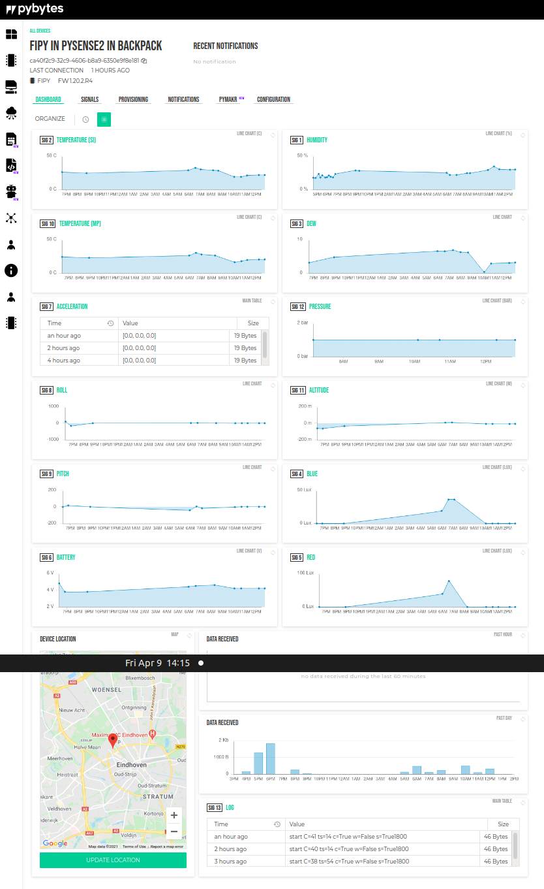

# Pybytes - Pysense demo
- Fipy
- Pysense2
- provision with Lora from Pybytes
- upload script
- configure sensors and dashboard in Pybytes similar to Screenshot.png

## led colors
YELLOW # connecting
GREEN  # connected
RED    # connection failed
PURPLE # wait for button
ORANGE # maintenance mode

## process
1. boot.py                                    - [YELLOW]
2. pybytes is starting up if pybytes_on_boot
3. main.py
  - if pybytes is started:
    - if pybytes is connected                 - [GREEN]
    - else                                    - [RED]
  - else: start it now asynchronously         - [YELLOW]
3. waiting for button                         - [PURPLE]
  - if button pressed, go to maintenance mode - [ORANGE]
4. check connection:
  - if connected                              - [GREEN]
  - else                                      - [RED]
5. gather sensor data and send it
6. wait for button to cancel                  - [PURPLE]
- if button pressed, go to maintenance mode - [ORANGE]
7. go to sleep                                - [bright BLUE flash]

## signal numbers
no name         unit HW/driver   Pysense Pytrack
 1 humidity          SI7006A20   S
 2 temperature  C    SI7006A20   S
 3 dew               SI7006A20   S
 4 blue         Lux  LTR329ALS01 S
 5 red          Lux  LTR329ALS01 S
 6 battery      V    Pycoproc    P       P
 7 acceleration      LIS2HH12    S       T
 8 roll              LIS2HH12    S       T
 9 pitch             LIS2HH12    S       T
10 temperature  C    MPL3115A2   E       E
11 altitude     m    MPL3115A2   S
12 pressure     hPa  MPL3115A2   S
13 Log               Micropython M       M
14 Lat/Lon      deg  L76GNSS             T
15 osm          url  L76GNSS             T
16 cpu          C    ESP32       E       E
17 Uptime       %    Micropython M       M
